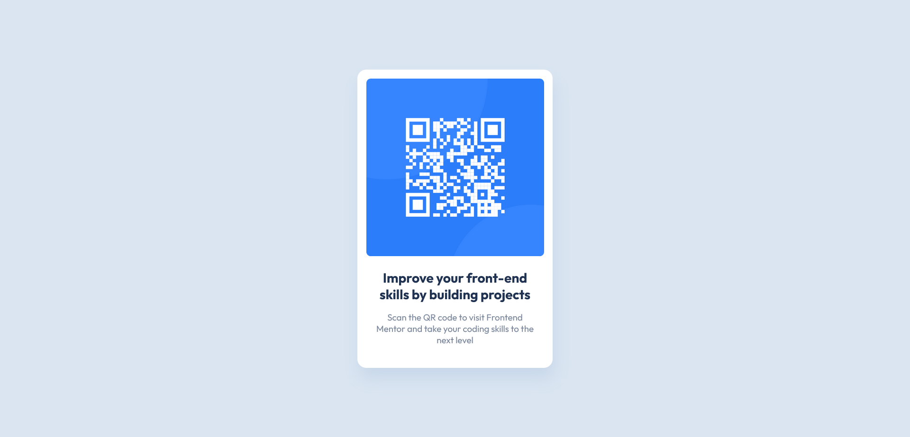

# Frontend Mentor - QR code component solution

This is a solution to the [QR code component challenge on Frontend Mentor](https://www.frontendmentor.io/challenges/qr-code-component-iux_sIO_H). Frontend Mentor challenges help you improve your coding skills by building realistic projects.

## Table of contents

- [Overview](#overview)
  - [Screenshot](#screenshot)
  - [Links](#links)
- [My process](#my-process)
  - [Built with](#built-with)
  - [What I learned](#what-i-learned)
  - [Continued development](#continued-development)
  - [Useful resources](#useful-resources)
- [Author](#author)

## Overview

### Screenshot

### Links

- Solution URL: [Add solution URL here](https://your-solution-url.com)
- Live Site URL: [https://fernandolribeiro.github.io/qr-code-component-solution/](https://fernandolribeiro.github.io/qr-code-component-solution/)

## My process

### Built with

- Semantic HTML5 markup
- CSS custom properties
- Flexbox

### What I learned

I learned the syntax for the CSS box-shadow property and that I should've written this README while I was building this project, because I've forgotten most of how the process of building this went. It was pretty good CSS practice though.

### Continued development

I need to get better at box-shadows. I haven't really used them at all before doing these Frontend Mentor challenges, so I never got to pratice enough to learn how to use them properly.

### Useful resources

- [MDN Web Docs article on box-shadow](https://developer.mozilla.org/en-US/docs/Web/CSS/box-shadow) - This helped me learn the syntax for the CSS box-shadow property.

## Author

- Frontend Mentor - [@fernandoLRibeiro](https://www.frontendmentor.io/profile/fernandoLRibeiro)
